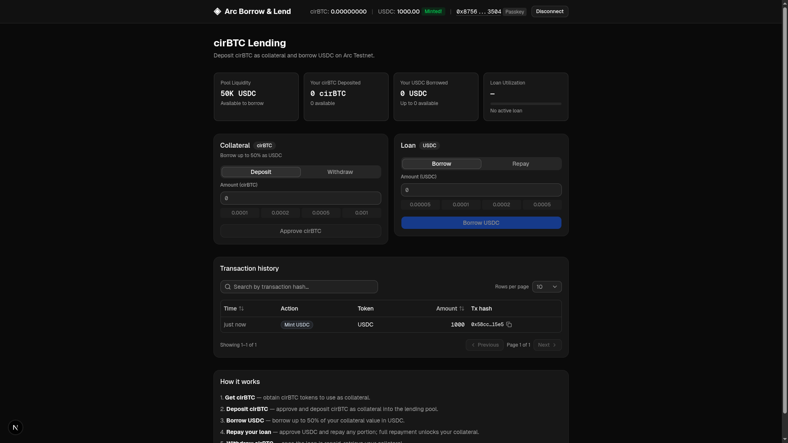

# Arc Borrow & Lend

A collateralized lending platform built on [Arc Testnet](https://arc.network/). Users connect a wallet, deposit cirBTC as collateral, and borrow USDC against it. The protocol is governed by a configurable collateral factor — by default users can borrow up to 50% of their deposited collateral value.



## Table of Contents

- [Prerequisites](#prerequisites)
- [Getting Started](#getting-started)
- [How It Works](#how-it-works)
- [Contract Overview](#contract-overview)
- [Loan Lifecycle](#loan-lifecycle)
- [Environment Variables](#environment-variables)
- [Project Structure](#project-structure)

## Prerequisites

- **Node.js v18+** - Install via [nvm](https://github.com/nvm-sh/nvm)
- **A wallet** - either:
  - **MetaMask** (or any injected EVM wallet) - connected to **Arc Testnet** (Chain ID `5042002`), or
  - **Circle Passkey Wallet** - browser-based biometric authentication via WebAuthn (no extension needed). Requires a [Circle developer account](https://console.circle.com/) for the client key and URL.
    > **Emulating passkeys in the browser:** If your browser does not support hardware passkeys (or you're developing without a biometric device), you can enable a virtual authenticator in DevTools:
    >
    > 1. Open **Developer Tools** (F12)
    > 2. Go to the **WebAuthn** tab (in Chromium-based browsers)
    > 3. Check **"Enable virtual authenticator environment"**
    > 4. Configure the virtual authenticator:
    >   - **Protocol**: `ctap2`
    >   - **Transport**: `internal`
    >   - **Supports resident keys**: `Yes`
    >   - **Supports user verification**: `Yes`
    >   - **Supports large blob**: `No`
    >
    > This creates a software-based authenticator that emulates biometric authentication, allowing passkey registration and login to work without physical hardware.
- **Arc Testnet USDC** - used for gas fees only. Obtain from the [Circle faucet](https://faucet.circle.com/) (20 USDC per request, every 2 hours per address).
- **cirBTC** - the collateral token for this protocol. Circle's wrapped Bitcoin on Arc Testnet (`0xf0C4a4CE82A5746AbAAd9425360Ab04fbBA432BF`).
  > **⚠️ cirBTC has no public faucet yet.** As of this writing, cirBTC is a "coming soon" product from Circle and is not distributed by `faucet.circle.com` or the developer-console faucet (both of which only dispense USDC/EURC/native gas tokens). The contract on Arc Testnet is Circle's standard `FiatTokenProxy`, which means only Circle-whitelisted minter addresses can mint — there is no self-serve on-chain faucet.
  >
  > To obtain cirBTC for testing, you currently need to either:
  >
  > 1. Request an allocation through [Circle's developer Discord](https://discord.gg/buildoncircle) / partner channels, or
  > 2. Receive a transfer from a wallet that already holds cirBTC (e.g. a team demo wallet).
  >
  > The mock USDC loan token deployed by this repo remains freely mintable via the in-app faucet button, so the rest of the flow is testable once you have any non-zero cirBTC balance.

## Getting Started

1. Clone the repository and install dependencies:
  ```bash
   git clone <repo-url>
   cd arc-borrow-lend
   npm install
  ```
2. Set up environment variables:
  ```bash
   cp .env.example .env.local
  ```
   Edit `.env.local` and fill in your deployer private key and (optionally) Circle credentials (see [Environment Variables](#environment-variables)). The Arc Testnet RPC URL defaults to [https://rpc.testnet.arc.network](https://rpc.testnet.arc.network).
  > **Note:** The public RPC rate-limits (HTTP 429) under the app's polling — balances and buttons can stall. For demos or heavy use, set `NEXT_PUBLIC_RPC_URL` to a dedicated provider (e.g. an Alchemy Arc Testnet endpoint).
  > **Note:** Deployment requires a **non-custodial wallet** (e.g. MetaMask) whose private key you can export. Custodial wallets like Circle passkey wallets do not expose private keys and cannot be used for deployment. The Circle wallet integration is for end users interacting with the deployed contracts via the frontend.
3. Compile and deploy the smart contracts:
  ```bash
   npm run compile
   npm run deploy:lending
  ```
   The deploy script:
  1. Uses the existing cirBTC token (`0xf0C4a4CE82A5746AbAAd9425360Ab04fbBA432BF`) as collateral — no deployment needed
  2. Deploys a mock USDC (TestnetERC20, 8 decimals) and mints 100,000 USDC to the deployer
  3. Deploys the `LendingBorrowing` contract with cirBTC as collateral, USDC as the lending token, and a 50% collateral factor
  4. Funds the lending pool with 50,000 USDC
  5. Writes all deployed addresses to `.env.local`
4. Start the development server:
  ```bash
   npm run dev
  ```
   The app will be available at `http://localhost:3000`.

## How It Works

- Built with [Next.js](https://nextjs.org/) App Router and [wagmi](https://wagmi.sh/) + [viem](https://viem.sh/) for wallet interactions
- **Dual wallet support**: users can connect via MetaMask (injected wallet) or a Circle passkey wallet (WebAuthn biometric authentication with smart account abstraction via `[@circle-fin/modular-wallets-core](https://www.npmjs.com/package/@circle-fin/modular-wallets-core)`). A unified `useContractWrite` hook abstracts the differences so all lending actions work identically with either wallet type.
- **Collateral**: cirBTC (Circle's wrapped Bitcoin on Arc Testnet, 8 decimals). Users deposit cirBTC to unlock borrowing capacity.
- **Lending token**: Mock USDC (8 decimals) - freely mintable via the UI faucet button. Users borrow USDC from the pool against their cirBTC collateral.
- **Collateral factor**: set at deployment (default 50%). Users can borrow up to `collateralFactor%` of their deposited cirBTC value in USDC. Both tokens use 8 decimals so the percentage math is exact with no decimal conversion.
- Only one active loan per user at a time. Collateral is locked while a loan is outstanding and released upon full repayment.
- Styled with [Tailwind CSS](https://tailwindcss.com) and components from [shadcn/ui](https://ui.shadcn.com/)
- Arc Testnet uses USDC as native gas — no separate ETH needed for transaction fees.

## Contract Overview

### `LendingBorrowing`

A simple collateralized lending protocol with the following interface:


| Function                      | Who   | Description                                                   |
| ----------------------------- | ----- | ------------------------------------------------------------- |
| `depositCollateral(amount)`   | User  | Deposit cirBTC as collateral (requires prior ERC20 approval)  |
| `takeLoan(amount)`            | User  | Borrow USDC up to `collateralFactor%` of deposited collateral |
| `repayLoan(amount)`           | User  | Repay USDC loan (partially or fully)                          |
| `withdrawCollateral(amount)`  | User  | Withdraw cirBTC not locked by an active loan                  |
| `fundPool(amount)`            | Owner | Fund the lending pool with USDC                               |
| `setCollateralFactor(factor)` | Owner | Update the collateral factor (1–100)                          |


**View helpers:**


| Function                    | Returns                                             |
| --------------------------- | --------------------------------------------------- |
| `maxBorrow(user)`           | Maximum USDC the user can currently borrow          |
| `availableCollateral(user)` | cirBTC available to withdraw (not locked by a loan) |
| `poolLiquidity()`           | Current USDC balance in the lending pool            |


## Loan Lifecycle


| Step | Action         | Description                                                                                                                                                          |
| ---- | -------------- | -------------------------------------------------------------------------------------------------------------------------------------------------------------------- |
| 1    | **Get cirBTC** | Obtain cirBTC on Arc Testnet to use as collateral (see [Prerequisites](#prerequisites) — no public faucet; distribution is via Circle Discord or a team demo wallet) |
| 2    | **Deposit**    | Approve and deposit cirBTC as collateral                                                                                                                             |
| 3    | **Borrow**     | Take a USDC loan up to the collateral factor limit                                                                                                                   |
| 4    | **Repay**      | Approve USDC and repay any portion of the outstanding loan                                                                                                           |
| 5    | **Withdraw**   | Once fully repaid, withdraw cirBTC collateral                                                                                                                        |


> Collateral is **locked** for the duration of an active loan and cannot be withdrawn until the loan is fully repaid.

## Environment Variables

All environment variables live in `.env.local`. The deploy script automatically writes contract addresses after a successful deployment.


| Variable                               | Purpose                                                                             |
| -------------------------------------- | ----------------------------------------------------------------------------------- |
| `PRIVATE_KEY`                          | Deployer wallet private key                                                         |
| `NEXT_PUBLIC_RPC_URL`                  | Alchemy RPC URL (used by both Hardhat and the frontend)                             |
| `NEXT_PUBLIC_CIRBTC_ADDRESS`           | cirBTC token address (hardcoded; auto-written by deploy script)                     |
| `NEXT_PUBLIC_USDC_ADDRESS`             | Deployed mock USDC address (auto-written by deploy script)                          |
| `NEXT_PUBLIC_LENDING_ADDRESS`          | Deployed LendingBorrowing contract address (auto-written)                           |
| `NEXT_PUBLIC_CIRCLE_CLIENT_KEY`        | Circle modular wallets client key (for passkey wallet)                              |
| `NEXT_PUBLIC_CIRCLE_CLIENT_URL`        | Circle modular wallets API URL (for passkey wallet)                                 |
| `NEXT_PUBLIC_EXPLORER_URL`             | Block explorer base URL used for transaction links (optional)                       |
| `NEXT_PUBLIC_SUPABASE_URL`             | Local Supabase API URL (default `http://127.0.0.1:54321`)                           |
| `NEXT_PUBLIC_SUPABASE_PUBLISHABLE_KEY` | Local Supabase publishable key (printed by `npm run db:start`; formerly "anon key") |


## Local Database (Supabase)

Transaction history is persisted in a locally self-hosted [Supabase](https://supabase.com) instance. Docker is required.

```bash
npm run db:start    # boots Postgres + Studio + REST
npm run db:status   # prints API URL, anon key, Studio URL
npm run db:stop
npm run db:reset    # re-run migrations, wipe data
```

On first run, copy the printed `Project URL` into `NEXT_PUBLIC_SUPABASE_URL` and the `Publishable` key into `NEXT_PUBLIC_SUPABASE_PUBLISHABLE_KEY` in `.env.local`. (Supabase recently renamed `anon` → `publishable` and `service_role` → `secret`; only the publishable key is needed here.) The initial migration (`supabase/migrations/*_init_transactions.sql`) creates the `transactions` table used by the history panel on the dashboard.

## Project Structure

```
arc-borrow-lend/
├── app/                                    # Next.js App Router pages
│   ├── layout.tsx
│   ├── page.tsx                            # Main lending & borrowing UI
│   ├── providers.tsx
│   └── globals.css
├── components/                             # React components
│   ├── trading/
│   │   └── TxStatus.tsx                    # Transaction status indicator
│   ├── wallet/                             # Wallet connection components
│   │   ├── ConnectDialog.tsx               # Wallet selection dialog
│   │   ├── ConnectWallet.tsx               # Wallet connect button + balances
│   │   └── CopyableText.tsx               # Click-to-copy address display
│   └── ui/                                 # shadcn/ui primitives (button, card, input, tabs, etc.)
├── contracts/                              # Solidity smart contracts
│   ├── LendingBorrowing.sol                # Collateralized lending protocol
│   └── TestnetERC20.sol                    # Mintable ERC20 for testnet (deployed as USDC)
├── contexts/
│   └── WalletContext.tsx                   # Dual-wallet state (MetaMask + Circle passkey)
├── hooks/
│   ├── useContractWrite.ts                 # Unified write hook for both wallet types
│   └── lending/                            # Lending hook modules
│       ├── index.ts
│       ├── useLendingState.ts              # Pool and user position state
│       └── useLendingActions.ts            # Deposit, withdraw, borrow, repay actions
├── lib/
│   ├── contracts/                          # Contract definitions
│   │   ├── addresses.ts                    # Deployed contract addresses from env vars
│   │   └── abis/                           # ABI definitions
│   ├── circle.ts                           # Circle passkey transport & client helpers
│   ├── errors.ts                           # Error parsing & user-friendly messages
│   ├── wagmi.ts                            # Wagmi + Arc Testnet chain config
│   └── utils.ts                            # Utility functions
├── public/                                 # Static assets
├── scripts/
│   └── deploy-lending.ts                   # Deploys mock USDC + LendingBorrowing, funds pool
├── hardhat.config.ts                       # Arc Testnet network & compiler settings
├── next.config.ts                          # Next.js configuration
├── package.json                            # All dependencies & scripts
└── .env.example                            # Environment variable template
```

## Security & Usage Model

This sample application:

- Targets Arc Testnet only
- Mock USDC is freely mintable — not suitable for production use without replacing with a real token
- cirBTC is an existing token on Arc Testnet and is not mintable via the app
- No interest rate model — this is an interest-free protocol for demonstration purposes
- Is not intended for production use without modification

